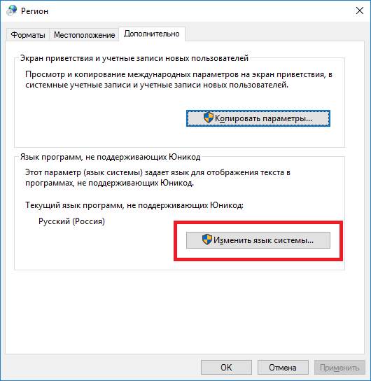
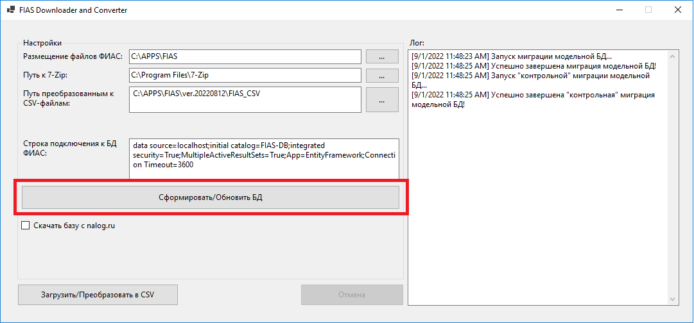
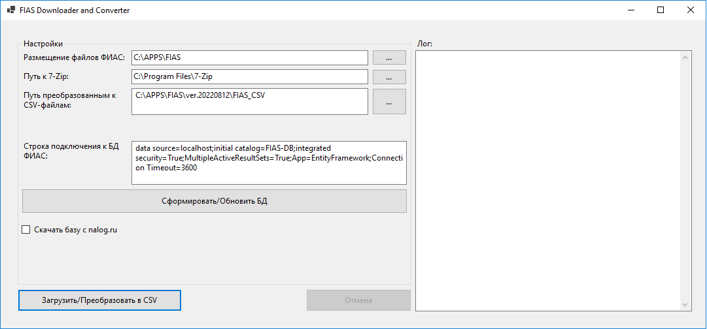
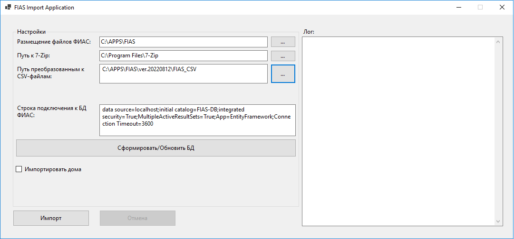

# Universe.FIAS


# Контроль версий    
Для удобства проект нужно клонировать по локальному пути C:\P\Universe.Framework.Core\ (но это совсем не обязательно)
*  master - основная рабочая ветка, изменения в нее попадают только через MergeRequests
*  develop - вторая основная рабочая ветка, изменения в нее попадают также, через MergeRequests

Для каждой задачи разработки/исправления ошибки заводится отдельный бранч.  

*Создается прямо из задачи, необходимо в названии задачи, ошибки, перед созданием указывать в скобках на английском языке не очень длинное наименование бранча.*

## Правила формирования сообщений к комиту
Сообщение может быть многострочным, например:  
#89 [Universe.FIAS] Добавлен поиск домов.  
#89 [Common]: Изменены ссылки на проекты.  
#89 [Universe.FIAS, Universe.FIAS.Normalizer] Добавлена функция нормализации адреса. 

где:
*  #89 - номер задачи (как правило совпадает с номером бранча) - в gitlab будет превращаться в ссылку на задачу,
  а при наведении мыши покажет название задачи
*  "Universe.FIAS:"" название функционала, в рамках которого делается коммит. Обязательно указывается с двоеточием на конце.
*  "Добавлена авторизация в web-приложении." - текст описывающий, что было сделано. Обязательно с точкой в конце, завершающей предложение.
*  Может быть перечислено несколько действий записываемые подобным образом
  н-р "#89 [Universe.FIAS]: Добавлены индексы в БД ФИАС. Оптимизированы запросы.""

*  [\~] - указываем в начале строки коммита, если мержим файлы вручную (автоматом git сам формирует сообщение). Сообщение должно быть вида:  
    [\~] Merge from develop to 20-build-ef-data-access-layer  
    или  
    [\~] Merge from develop to #20 

# Средства разработки
Для разработки использовать VS 2017, VS2019 дополнительно должны быть установлены:
*  поддержка PowerShell проектов (это устанавливается при устаноке VS)
*  git интегрируемый в студию (это устанавливается при устаноке VS)
*  ReSharper 2016.2.2 или более новый
*  Если после обновления из ветки develop, у проектов слетели References, а в ошибке фигурирует "NuGet", можно сделать следующее:
   на Solution нажать правую кнопку мыши и выбрать и выбрать Restore NuGet Packages. Затем Clean solution, build solution.
*  Чтобы NuGet ресторил сборки автоматически, нужно сделать следующее:
   в меню Tools - Options - NuGet Package Manager выставить 2 галки:
   - Allow NuGet to download missing packages;
   - Automaticall check for missing packages during build in Visual Studio.
*  MSSQL Server 2014 и выше
* Visual Stidio Code 1.42 и выше

# Версии ПО/платформ/ библиотек
*  MSSQL 2019 (Build 16.100.46041.41) 

# Обратить внимание
*  На кодировку файлов (особенно *.ps1), должна быть UTF-8

# Coding Style
*  По оформлению кода придерживаться настроек решарпера в файле ReSharper.DotSettings
* !Перед коммитом обязательно выполнять реформат измененного кода по схеме ResharperSln (исключением является кодоген и код
 сгененированны T4 шаблоном) 
*  При реформате выбирать профиль ResharperSln для полного реформата, ResharperSln NoSort для классов в которых нельзя изменять порядок
*  Блок catch, если в блоке catch, нет `throw ...;`, то необходимо указать комментарий почему его тут нет, например
 как в примере ниже  
 Если в блоке catch создается новый инстанс ошибки, то обязательно необходимо указать исходную ошибку, или комментарий
 почему исходная ошибка не должна указываться.
```c#
catch (Exception ex) {
    _log.Unexpected(ex);
    //throw; Что бы здесь не произошло, это не должно повлиять на выполнение всего остального
}
````

# Инструкция по установке

1. Установить AccessDatabaseEngine_X64 из папки Support.
	Загрузить и установить архиватор 7-zip с сайта https://www.7-zip.org.
	Установить MSSQL Server 2019 и развернуть инстанс баз данных.
	
2. Убедиться, что установлена русская локаль и язык русский. 
	А также должен быть установлен в качестве языка программ не поддерживающих Юникод: Русский.



    В приложении преобразования нажать на кнопку Сформировать/Обновить БД и сформировать FIAS-DB:



    После того, как БД будет сформирована проверить, что БД создалась с Collation Cyrillic_General_CI_AS. 
	    
3. Перед запуском приложений преобразования и импорта убедится, что на жёстком диске имеется не менее 80 Гб свободного дискового пространства.
	
4. Запустить и настроить загрузку файлос с ФИАС и их преобразование в CSV FIAS.ConvertApp.
   Настройки примерно следующие:
	     
,

	* В размещении файлов ФИАС указываем, куда будет загружен архив с файлами баз данных в формате DBF.
	* В текстовом поле 'Путь к 7-zip' указываем, расположение исполняемого файла архиватора 7-zip.
	* В текстовом поле 'Путь преобразованным к CSV-файлам' указываем, куда будут сохранены преобразованные в CSV файлы.
	* В текстовом поле 'Строка подключения к БД ФИАС' указываем строку подключения к формируемой БД ФИАС.
	* Если не был заранее скачан архив с сайта nalog.ru, то отметить галочкой пункт 'Скачать базу с nalog.ru'.

Нажать кнопку 'Загрузить/Преобразовать в CSV', затем дождаться окончания выполнения.

5. Загрузка CSV в БД ФИАС FIAS.ImportApp.
   Настройки примерно следующие:

,

	* В размещении файлов ФИАС указываем, куда был загружен архив файлами баз данных в формате DBF.
	* В текстовом поле 'Путь к 7-zip' указываем, расположение исполняемого файла архиватора 7-zip.
	* В текстовом поле 'Путь преобразованным к CSV-файлам' указываем, преобразованные в CSV файлы,
	которые будут импортироваться в БД ФИАС.
	* В текстовом поле 'Строка подключения к БД ФИАС' указываем строку подключения к формируемой БД ФИАС.
	* По-умолчанию возможность загружать дома отключена. Если необходимо загрузить дома в БД ФИАС,
	то нужно отметить галочкой пункт 'Импортировать дома'.

Нажать кнопку 'Импорт', затем дождаться окончания выполнения.